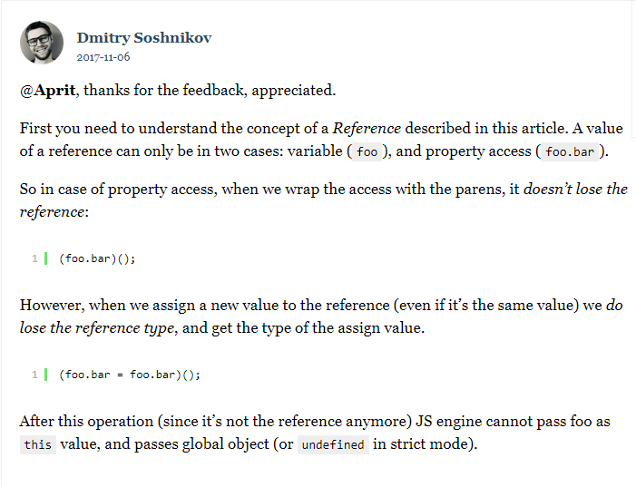

从来没有深入了解ECMA，网上找了一下，发现早在2010年就有大佬 [Dmitry Soshnikov](http://dmitrysoshnikov.com/about/) 总结了ECMA中的核心内容，我这里只是翻译记录，加深自己的印象。文章原文来自 [ECMA-262-3 in detail. Chapter 3. This.](http://dmitrysoshnikov.com/ecmascript/chapter-3-this/)

## 介绍

在这篇文章里，我们将讨论更多与执行上下文相关的细节。讨论的主题就是 `This` 关键字。

实践证明，这个主题很难，并且在不同的执行上下文中经常导致确定 `this` 的值很难。

许多程序员认为，在程序语言中， `this` 关键字与面向对象编程很接近（紧密相关），它完全指向于由构造函数新创建的对象。在ECMAScript中，这个概念也得到了实现，但是，正如我们即将看到的，这里的概念不仅限于所创建对象的定义。

让我们更详细的了解一下，在ECMAScript中， `this` 的值到底是什么。

## 定义

> `this` 是执行上下文的一个属性。这是一个在代码初始时就存在的一个特殊对象。

```jsx
activeExecutionContext = {
	VO: {...},
	this: thisValue
}
```

其中的 VO 就是[上一章](./ECMA-262-3%20详解：2、变量对象.md)中我们讨论过的变量对象。

`this` 与[上下文中可执行代码类型](./ECMA-262-3%20详解：1、执行上下文.md)直接相关。这个值在进入上下文的时候就已经确定了，并且在代码运行的时候不会改变。

让我们更详细的考虑一下这些情况。

## 全局代码中的This的值

在这里，一切都很简单。在全局代码中， `this` 的值总是指向 *global object（全局对象自身）*。因此，可以间接使用它：

```jsx
// 显示的在全局对象上定义属性
this.a = 10; // global.a = 10;
console.log(a); //10

// 通过分配不合规的标识符进行隐式定义
b = 20;
console.log(this.b); // 20

// 通过变量声明的形式隐式定义，因为全局上下文中的变量对象就是全局对象自己
var c = 30;
console.log(this.c); // 30
```

## 函数代码中的This值

当 `this` 的值在函数代码中的时候，事情变得更加有趣了。这种情况很难（理解this），并且可能会造成很多问题。

在这种类型的代码中， `this` 的第一（或者说，主要）特征就是 `this` 没有静态的与函数绑定。

上面已经提到了， `this` 的值是在进行上下文的时候就已经确定了的，但是在函数代码的这种情况下， `this` 的值可能在每一次（进入执行上下文）都不同。

但是，在代码运行的时候， `this` 的值是不可变的。例如：不能传递一个新的值给他，因为他*不是一个变量*。相比之下，使用 `Python` 编程语言及其显示定义的 `self` 对象，都是可以在运行的时候进行多次更改。

```jsx
var foo = {x: 10};

var bar = {
	x: 20,
	test: function() {
		console.log(this === bar); // true
		console.log(this.x); // 20

		this = foo; // 报错了 Invalid left-hand side in assignment
		console.log(this.x); // 如果没有报错的话，将会是10而不是20
	}
}

// 当进入上下文的时候，this的值被确定为 ‘bar’ 对象
// 为什么会这样，将会在下面讨论
bar.test(); // true, 20
foo.test = bat.test;

// 但是，这里的 this 值没有指向 'foo' -- 即使我们调用了相同的函数 
foo.test(); // false, 10
```

那么，什么会影响函数代码中 `this` 的值呢？有几种因素。

首先，在通常的函数调用中， `this` 是由激活上下文的调用者提供（就是我们说的谁调用就指向谁），即调用户数的父级上下文。 `this` 的值取决于调用函数的方式。（换句话说，在语法构成上，函数是以怎样的形式被调用的）

为了能够在任何上下文中毫无疑问的确定 `this` 的值，理解并记住这个重点是非常有必要的。调用表达式的确切形式，或者说调用函数的方法影响了调用上下文中的 `this` 值而不是其他（情况）。

（我们在一些文章甚至是关于Javascript的书籍中看到，他们指出： `this` 值取决于函数如何定义：如果是一个全局函数， `this` 指向全局对象，如果是一个对象的方法， `this` 总是指向这个对象。 — 这绝对是不正确的）。继续，我们可以看到，即使是普通的全局函数也可以被不同形式的的调用形式激活，这些不同的形式影响了不同的 `this` 值。

```jsx
function foo() {
	console.log(this);
}

foo(); // global

console.log(foo === foo.prototype.constructor); // true

// 但是相同的函数使用另一种形式， this 值就不一样了
foo.prototype.constructor(); // foo.prototype
```

作为一个对象的方法来调用的时候也可能出现类似的情况， `this` 的值不会是这个对象。

```jsx
var foo = {
	bar: function() {
		console.log(this);
		console.log(this === foo);
	}
}

foo.bar(); // foo, true

var exampleFunc = foo.bar;
console.log(exampleFunc === foo.bar); // true

// 再一次，相同函数的不同调用方式，不同的this值
exampleFunc(); // global, false
```

所以，不同调用形式是怎样影响 `this` 值的呢？为了充分了解 `this` 的值，有必要详细分析一种内部类型 — 引用类型（Reference Type）。

## 引用类型

使用伪代码（假设存在这样的代码）的形式可以将 `Reference` 的值表示为一个含有两个属性的对象：

- base（拥有这个属性的对象）
- base中的propertyName

```jsx
var valueOfReferenceType = {
	base: <base object>,
	propertyName: <property name>
};
```

**注意：从ES5开始，在使用严格模式（use strict）的代码中，一个引用也包含了一个名为 `strict` 的属性。**

```jsx
'use strict';

foo;

const fooReference = {
	base: global,
	propertyName: foo,
	strict: true
};
```

引用类型的值只有两种情况：

1. 当我们处理一个标识符（原文：when we deal with an identifier）
2. 或者一个属性访问器（原文：or with a property accessor）

标识符的处理过程会在[Chapter 4. Scope chain](./ECMA-262-3%20详解：4、作用域链.md)中详细介绍。这里呢，我们只需要注意，从这个算法返回值总是一个引用类型的值（这对 `this` 的值很重要）。

**标识符是变量名，函数名，函数参数名和全局对象中不合规（没有定义）的属性名**。例如，下面标识符中的值：

```jsx
var foo = 10;
function bar(){};
```

在操作的过度结果中，引用类型对应的值如下：

```jsx
var fooReference = {
	base: global,
	propertyName: 'foo'
};

var barReference = {
	base: global,
	propertyName: 'bar'
}
```

为了从引用类型的值中获取一个对象真正的值，在伪代码中可以使用 `GetValue` 方法，就像下面这样：

```jsx
function GetValue(value) {
	if (Type(value) != Reference) {
		return value;
	}

	var base = GetBase(value);

	if (base === null) {
		return new ReferenceError;
	}
	return base.[[get]](GetPropertyName(value));
}
```

内部 `[[Get]]` 方法返回对象属性的真实值，包括对原型链继承属性的分析：

```jsx
GetValue(fooReference); // 10
GetValue(barReference); // function object 'bar'
```

属性访问器应该知道，他的两种变体：点（.）符号（当属性名是正确的标识符且实现知道的时候），和括号（[]）符号。

```jsx
foo.bar();
foo['bar']();
```

在计算中间的返回值中，引用类型对应的值如下：

```jsx
var fooBarReference = {
  base: foo,
  propertyName: 'bar'
};
 
GetValue(fooBarReference); // function object "bar"
```

那么，引用类型的值又和函数上下文中的 `this` 的值又是怎样关联起来的呢？**重点来了**，这个关联时机是整篇文章个核心。在一个函数上下文中， 确定`this` 值的通用规则如下：

- 函数上下文中的 `this` 值由调用者提供，由函数调用的方式决定（语法上怎么写函数就怎么调用）
- 如果调用括号()的左侧是一个引用类型的值， `this` 将被设置成这个引用类型值的 base 对象。
- 所有的其他情况中（与引用类型不同的任何其它属性）, `this` 的值往往都是 `null` 。但是 `this` 值为 `null` 将没有任何意义，所以，他将隐式的被转换成全局对象。

看一个例子：

```jsx
function foo() {return this};
foo(); // global
```

我们看到在括号调用的左边是一个引用类型值（因为 foo 是一个标识符）：

```jsx
var fooFeference = {
	base: global,
	propertyName: 'foo'
}；
```

因此， `this` 的值被设置成了引用类型值的base对象，即，全局对象。

相似的情况也出现在属性访问中：

```jsx
var foo = {
	bar: function() {return this};
};

foo.bar(); // foo
```

同样，我们拥有一个引用类型的值，其base是foo对象，在bar函数激活的时候将base赋值给this。

```jsx
var fooBarReference = {
  base: foo,
  propertyName: 'bar'
};
```

然而，同样的函数，使用另一种方式执行，得到不一样的值：

```jsx
var test = foo.bar;
test(); // global
```

因为 `test` 是标识符，生成了其他引用类型值，该值的base（全局对象）被设置为this的值。

```jsx
var testReference = {
  base: global,
  propertyName: 'test'
};
```

注意：在ES5的严格模式中， `this`值没有强制指向全局对象，而是`undefined`

现在，我们可以很明确的说，为什么用不同的形式激活相同的函数会有不一样的 `this` 值呢？答案是引用类型的不同中间值。

```jsx
function foo() {
	console.log(this);
}

foo(); // global object

var fooReference = {
	base: global,
	propertyName: 'foo'
};

console.log(foo === foo.prototype.constructor); // true

foo.prototype.constructor(); // foo.prototype, 因为

var fooPrototypeConstructorReference = {
	base: foo.prototype,
	propertyName: 'constructor'
};
```

另一个动态确定 `this` 值的（经典）例子，就是调用表达式的方式：

```jsx
function foo() {
	console.log(this.bar);
}

var x = {bar: 10};
var y = {bar: 20};

x.test = foo;
y.test = foo;

x.test(); // 10
y.test(); // 20
```

## 函数调用与非引用类型

因此，正如我们上面提到的，如果在调用括号的左侧有一个不是引用类型的值，而是其他类型的值，那么 `this` 的值将自动设置为 `null` ，最终的结果就是， `this` 指向了全局对象。

```jsx
(function() {
	console.log(this); // null ==> global
})();
```

这个例子中，（括号左侧）是一个函数对象而不是一个引用类型的对象（他不是标识符也不是属性访问器），相应的， `this` 的值最终设置成了全局对象。

更复杂的例子：

```jsx
var foo = {
	bar: function() {
		console.log(this);
	}
};

foo.bar(); // Reference, OK ==> foo
(foo.bar)(); // Reference, OK ==> foo

(foo.bar = foo.bar)(); // global ?
(false || foo.bar)(); // global ?
(foo.bar, foo.bar)(); // global ?
```

那么，为什么有一个属性访问器了，中间值也是一个引用类型的值，在某些调用中，我们得到的 `this` 值不是base对象而是global。

问题出现在最后的三个调用中，在调用某些操作后，括号左侧的值将**不再是**引用类型。

在第二个例子中，分组运算（grouping operator，结合上面的例子，这里指的就是这个`()`）没有生效，仔细想想上面提到的，从一个引用类型获取真正值的方法，如：`GetValue` 。因此，分组运算的返回值依旧是一个引用类型的值，这就是为什么 `this` 值仍然是base对象，即这里的 `foo` 。

在第三个例子中，不像分组运算，复制运算调用了 `GetValue` 方法。结果就是这个运算返回的是一个函数对象（而不是一个引用类型），这就意味着， `this` 值成了 `null` ，最终指向了global。

第四个与第五个也是一样的，逗号运算与逻辑运算（OR）调用了 `GetValue` 方法，失去了引用类型的值，取而代之的是一个函数类型的值，最终 `this` 指向了global。

**关于这个问题，其实有点模糊，原文中作者为一个名叫Aprit的提问者做出了这样的回答**：



## 引用类型与this为null

有一种情况，当括号左侧的表达式（即调用方式）决定了引用类型的值， `this` 的值无论是以何种方式设置成 `null` 的，最终都将被设置成 global。当引用类型的base对象是一个活动对象的时候就造成这种情况。

我们可以从父级调用内部函数的例子中看到这种情况。在[第二章](./ECMA-262-3%20详解：2、变量对象.md)我我们了解到，局部变量，内部函数和形式参数存储在给定函数的活动对象中：

```jsx
function foo() {
	function bar() {
		console.log(this); // global
	}
	bar(); // 等同于 AO.bar()
}
```

活动对象总是作为 `this` 的值返回 — null（伪代码 `AO.bar()` 等同于 `null.bar()`）。再次回到上面的描述中， `this` 的值再次被设置为 null。

有一个例外，在 `with` 语句中调用一个函数且 `with` 对象包含函数名称属性（结合下面的例子，值得应该是属性对应的值是一个函数）。 `with` 语言把他的对象添加到[作用域链](./ECMA-262-3%20详解：4、作用域链.md)的最前端，即在活动对象之前。因此，引用类型有值（通过标识符或者属性访问器），base对象不是活动对象而是 `with` 语句对象。顺便提一下，这种情况不仅与内部函数有关，也与全局函数有关，因为 `with` 对象比作用域链的顶层对象（全局对象或者活动对象）还有靠前。

```jsx
var x = 10;
 
with ({
 
  foo: function () {
    console.log(this.x);
  },
  x: 20
 
}) {
 
  foo(); // 20
 
}
 
// because
 
var  fooReference = {
  base: __withObject,
  propertyName: 'foo'
};
```

在 `catch` 语句中的实际参数的函数调用也存在相同的情况：在这种情况下， `catch` 对象也是被添加到了作用域链的最前端，在活动对象或者全局对象之前。但是，这种表现在 ECMA-262-3 中被认为是一个bug，并且在 ECMA-262-5 中被修复。修复后，在给定的活动中， `this` 值指向的是全局对象而不是 `catch` 对象。

```jsx
try {
  throw function () {
    console.log(this);
  };
} catch (e) {
  e(); // __catchObject - in ES3, global - fixed in ES5
}
 
// on idea
 
var eReference = {
  base: __catchObject,
  propertyName: 'e'
};
 
// but, as this is a bug
// then this value is forced to global
// null => global
 
var eReference = {
  base: global,
  propertyName: 'e'
};
```

同样的情况还出现在[命名函数](./ECMA-262-3%20详解：5、函数.md)（关于函数的更多细节查看 [Chapter 5. Functions](./ECMA-262-3%20详解：5、函数.md)）的递归调用中。在函数第一次调用的时候，base对象是父级的活动对象（或者是全局对象），在递归调用中，base对象应该是存储着函数表达式可选名称的特殊对象。但是，在这个例子中， `this` 总是被设置为 global。

```jsx
(function foo(bar) {
 
  console.log(this);
 
  !bar && foo(1); // "should" be special object, but always (correct) global
 
})(); // global
```

## 构造函数中的 this 值

还有一个在函数上下文中和 `this` 值息息相关的例子 — 函数作为构造器调用。

```jsx
function A() {
  console.log(this); // newly created object, below - "a" object
  this.x = 10;
}
 
var a = new A();
console.log(a.x); // 10
```

在这个例子中，new操作符调用 `A` 函数内部的 [[Constructor]] 方法，在创建对象以后，接着调用内部的 [[Call]] 方法，所有相同函数 `A` ，都将 `this` 值设置为新创建的对象。

## 手动设置一个函数调用的this

在 `Function.prototype` 中定义了两个方法（因此所有的函数都可以访问），函数调用的时候可以手动的修改 `this` 值。他们是 `call` 和 `apply` 方法。

这两个函数都可以在函数执行上下文中将 `this` 值设置为接收的第一个参数。两个方法的区别不大：对于 `apply` 来说，第二个参数必须是一个数组（或者是一个类数组的对象，比如： `arguments` ）。相反的， `call` 方法可以接收任何参数。两个方法都必须有第一个参数 — this。

例如：

```jsx
var b = 10;
 
function a(c) {
  console.log(this.b);
  console.log(c);
}
 
a(20); // this === global, this.b == 10, c == 20
 
a.call({b: 20}, 30); // this === {b: 20}, this.b == 20, c == 30
a.apply({b: 30}, [40]) // this === {b: 30}, this.b == 30, c == 40
```

​