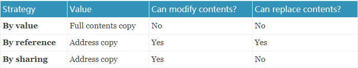
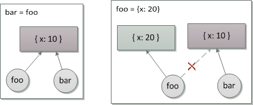

从来没有深入了解ECMA，网上找了一下，发现早在2010年就有大佬 [Dmitry Soshnikov](http://dmitrysoshnikov.com/about/) 总结了ECMA中的核心内容，我这里只是翻译记录，加深自己的印象。文章原文来自 [ECMA-262-3 in detail. Chapter 8. Evaluation strategy。](http://dmitrysoshnikov.com/ecmascript/chapter-8-evaluation-strategy/)

# 介绍

这篇短篇中我们将会考虑一下在ECMAScript中给函数传递参数的策略。

通常，计算机科学的这部分被称为*评估策略*，即，一组用于评估某些表达式的语义的规则。函数传递参数的策略就是其中一种情况。

许多开发者习惯于认为JavaScript中的对象是按引用传递的，而原始事物是按值传递的。实际上，该声明定期出现在各种有关JavaScript的文章，讨论甚至是书籍中。在本文中，我们将会澄清，这个术语在JavaScript中的有效性（以及是否有效）。

## 一般理论

在深入研究ECMAScript细节之前，我们需要先讨论一些与参数传递有关的一般理论。

### 渴望(eager)与懒惰(lazy)评估

从初步评估的角度，这里有两个重要的策略：*严格（strict）（有时候被叫做渴望）*，意味着参数是在他们使用前评估，另一个是*不严格（no-strict）*，表示评估是在实际使用参数时按需进行的（又叫做*懒惰*评估）。

ECMAScript，与其它语言（C, Java, Python, Runy等等）一样对参数使用渴望评估：

```jsx
function eager(x) {
  console.log(x);
}
 
eager(y); // ReferenceError: "y" is not defined
```

在上面的例子中，错误是在函数调用之前立即抛出的，即，所有的参数必须在传递之前进行严格评估。

在JavaScript中，懒惰评估通过回调实现：

```jsx
function lazy(onDemandGetter) {
  console.log(onDemandGetter()); // ReferenceError: "y" is not defined
}
 
lazy(() => y); // OK
```

在懒惰评估中，错误只会在我们尝试访问变量的时候抛出。在这个例子中，错误可能抛出，也可能不，这取决于我们是否真的需要这个参数，以及这个变量是否在将来存在。

### 参数评估顺序

此外，参数评估与传递的顺下也是被标准了：从左往右。一些其他语言可能使用相反的评估顺序，即从右往左。甚至一些语言没有规定，比如C++。

🌰：

```jsx
function foo(...args) {
  console.log(args); // [1, 2, 3]
}
 
foo(
  (() => { console.log(1); return 1; })(), // 1
  (() => { console.log(2); return 2; })(), // 2
  (() => { console.log(3); return 3; })(), // 3
);
```

这里我们传递了三个参数，并使用 `console.log()` 打印每个参数，我们看到正确保持了从左往右的顺序。

**注意：JavaScript中从左往右使用严格评估。**

现在我们讨论一下传递参数到函数的方法。因为不是所有下面要讨论的策略都用于ECMAScript，在我们的例子中，我们将使用伪代码来描述与展示抽象算法。

### 按值调用（Call By Value）

让我们从最简单的策略开始，“按值”。

这种策略是许多开发者熟知的。这里参数的值是传入对象的复制。函数内部的修改不会影响外面传递的对象。技术上，运行时分配新的内存块，复制传递对象的所有内容到里面，接下来函数可以使用来自新地址的新对象。

```jsx
// Pseudo-code:
 
bar = 10
  
procedure foo(barArg):
  barArg = 20;
end
  
foo(bar)
  
// changes inside foo didn't affect
// the bar which is outside
print(bar) // 10
```

对于原始值，这种策略很棒，但是，当我们必须处理较大的复杂结构（即实际对象）时，这很快就会成为性能瓶颈。这是在C++中发生的事，当我们传递一个更大的结构时，他会完全复制到一个新的内存地址。

**注意**：除非你明确需要，否则请避免在C++中按值传递大对象。使用 const 引用代替。

我们创建两个用于描述我们下面策略的一般函数。第一个， `modifyProperties` ，仅仅是更新对象的属性：

```jsx
procedure modifyProperties(object):
  object.x = 100;
  object.y = 200;
end
```

第二个， `rewriteObject` ，通过分配参数，尝试使用新对象完全替换对象内容：

```jsx
procedure rewriteObject(object):
  object = {newX: 1, newY: 2};
end
```

为了重申对按值语言的描述，这两个函数均不影响我们的对象：

```jsx
point = {
  x: 10,
  y: 20
}
  
modifyProperties(point)
  
// Still the same: 
print(point) // {x: 10, y: 20}
  
// Also, still the same:
rewriteObject(point) // {x: 10, y: 20}
```

同样，传递对象的完整副本可能导致较大的性能问题，尤其是在我们需要多个此类对象的情况下。

现在，我们来看看按引用策略。

### 按引用调用

相反，按引用策略接收的不是一个复制，而是接收对象的隐式引用。并且这个引用时直接映射（就像一个别名）到了外面的对象。函数内部的函数的任何修改，无论是属性的修改还是完全重写都会立刻反应到原始对象上。

伪代码：

```jsx
// Having the same point object:
point = {
  x: 10,
  y: 20
}
  
// Update the properties: 
modifyProperties(point)
 
print(point) // OK, changed {x: 100, y: 200}
  
// Completely rewrite external contents:
rewriteObject(point)
  
print(point) // Yes, rewritten: {newX: 1, newY: 2}
```

也就是说，按引用传递比通按传递要高效的多。但是在一般理论（就像一个别名）中，它允许完全重写对象的内容。

现在我们看看组个策略，通过共享。

### 通过共享调用

如果开发者总是很熟悉开始的两个策略，那么下一种策略，尤其是其术语，并未广泛运用。但是我们将要看到，在ECMAScript传参中这种策略正好扮演了关键角色。

该策略的可选择名称是”通过对象调用“或者”通过对象共享调用“。

"共享"策略在1974年由[Barbara Liskov](https://en.wikipedia.org/wiki/Barbara_Liskov)提出并首次命名为[CLU](https://en.wikipedia.org/wiki/CLU_programming_language)编程语言。

这种策略的最主要的不同是函数接收对象引用的副本。这个引用副本与形式参数相关联，并且就是形参的值。

在这种情况，重新分配新值不会替换原始对象（正如引用策略所做的那样）。然而，因为形式参数依旧接收地址，因此它可以访问原始对象的内容（属性）并对其进行突变。

```jsx
// Again the same point object:
point = {
  x: 10,
  y: 20
}
  
// By-sharing can update the properties:
modifyProperties(point)
  
print(point) // Yes, updated: {x: 100, y: 200}
  
// But it cannot fully rewrite its contents:
rewriteObject(point)
  
print(point) // Nope, still the: {x: 100, y: 200}
```

这种策略假定语言通常使用对象而不是原始值来操作。

### 通过共享作为值的特例（By sharing as a special case of by value）

共享策略在许多语言中使用：Java， ECMAScript，Python，Ruby，Visual Basic等等。

而且，在Python社区中正是通过共享使用这种术语。

然而，在其他的语言中，例如Java，ECMAScirpt以及其他的，这种策略也叫做*按值*，即*一个引用副本的特殊值*。

### 通过共享与指针（By sharing and pointers）

关于C/C++，这种策略与通过指针传递类似。仅在C语言中，仍然可以取消引用指针并从外部更改对象。

但是，为指针重新分配一个值仅仅只是把它重新绑定到一个小的内存块中，而不影响旧的内存块。仍然可以使用指针修改原始对象的属性。

因此，与指针进行类比，我们可以很明显地看到这是通过地址的值传递的，而指针到底是什么。在这种情况下，通过共享是某种“语法糖”，该“语法糖”在分配时的行为类似于“非解除引用”指针，并且在属性发生更改的情况下（如引用），不需要进行解除引用操作。有时可以将其命名为“安全指针”。

C/C++也有特殊的语法糖：

```jsx
obj->x instead of (*obj).x
```

这个注意也可以在C++的 `std::shared_ptr` 示例中看到。这也允许在函数参数与外界之间共享对象（即函数可以修改对象的字段），但是重新分配仅更改指针本身，而不会影响外面的对象。该数据类型甚至称为*shared_ptr*.

## 对比表

这里是一个简单的对比表，可以看出”by reference“ 和 ”by sharing“策略的细微差别。



可以看出，他们仅在分配语义上有所不同：”by reference“可以完全替换内容，而”by sharing“将指针重新绑定到新的对象。

实际上，C++中的引用只是指针的语法糖。在较低级别上，它们甚至被编译为相同的确切指令，并具有相同的值-即地址。但是，引用会更改高级语义，使赋值运算符的行为不同于指针，并且在“通过共享”策略中使用。

## ECMAScirpt实现

所以现在更清晰了，ECMAScript中使用的是哪一个评估策略 — 共享策略。即，我们可以修改对象的属性，但是不能完全重新分配它。分配仅将参数名称重新绑定到新的存储器，而保持原始对象不变。

但是正如我们更早提到的，此策略的通用“按值”术语可以在JS程序员中使用-再次表示指针的值。 JavaScript发明者Brendan Eich也注意到引用的副本已传递。

这种行为也可以在一个简单的分配中看到。在这种情况下我们可以看到：我们有两个不同的变量，但是两个共享相同的值 — 对象的地址。

ECMAScirpt代码：

```jsx
// Bind `foo` to {x: 10} object:
var foo = {x: 10};
  
console.log(foo.x); // 10
  
// Bind `bar` to the *same* object
// as `foo` identifier is bound to:
  
var bar = foo;
  
console.log(foo === bar); // true
console.log(bar.x); // OK, also 10
  
// And now rebind `foo` to the new object:
  
foo = {x: 20};
  
console.log(foo.x); // 20
  
// And `bar` still points
// to the old object:
  
console.log(bar.x); // 10
console.log(foo === bar); // false
```

（重新）绑定的操作（即，将变量值设置对象地址）可以在下面的图中证实：



将一个变量分配给另一个变量只会复制其地址，从而使两个变量都指向相同的内存位置。接下来对新值的分配，将名称与旧地址解除绑定，并将其重新绑定到新地址。与按引用策略相比，这是一个重要的区别，这正是对象也作为参数传递给函数的方式。

一旦有了对象的地址，就可以更改其内容（更新的属性），这就是Mutation的操作。

# 术语版本

在这种情况下，让我们定义与ECMAScript相关的正确术语的版本。
它可以是“按值调用”，其中指定了按值调用的特殊情况 — 当值是地址副本时。从这个位置可以说*ECMAScript中的所有内容都是按值传递的*。
或者，“通过共享调用”，这与“按引用”和“按价值”有所区别。在这种情况下，可以分隔传递类型：*原始值是通过值与对象（即共享）传递的*。
语句“*对象按引用传递*”在形式上与ECMAScript不相关，并且是错误的。

​